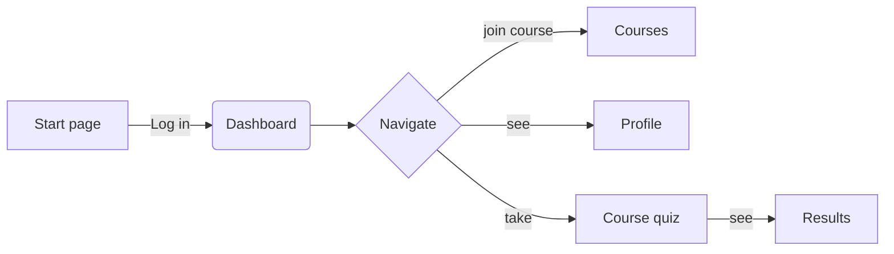
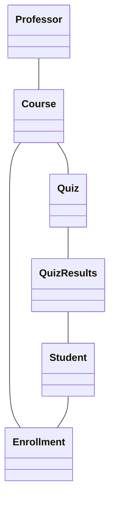

# ITPE3200 Webapplikasjoner: SubApp 1

Oppgavebeskrivelse [Kravspesifikasjon og kontrakt](https://oslomet.instructure.com/courses/34659/assignments/124642)  
Oppgavebeskrivelse [MVP](https://oslomet.instructure.com/courses/34659/assignments/124641)   
[Eksamensoppgaven](https://oslomet.instructure.com/courses/34659/assignments/124639)  

[Fellesdokument](https://hioa365-my.sharepoint.com/:w:/r/personal/manod3853_oslomet_no/_layouts/15/Doc.aspx?sourcedoc=%7B7E8E51EE-6ECC-47D3-AA2E-8E3D16F74FF5%7D&file=Webapplikasjoner.docx&action=default&mobileredirect=true&wdOrigin=WORDONLINE.SHELL%2CAPPHOME-WEB.FILEBROWSER.RECENT&wdPreviousSession=bb9bf9ee-2ae3-4d55-bafd-774a6f5af4a0&wdPreviousSessionSrc=AppHomeWeb&ct=1790152314841)

## Prosjektet: Gamifisert læringsplattform
This tool turns course contents (e.g., you can use this course ITPE3200) into interactive challenges to boost student engagement. The goal is to let students practice course material, test their knowledge, and track their learning progress over time. Some functionalities as inspirations (not requirements):  
* Create, edit, and organise sets of study questions, quizzes, or coding tasks, submit answers to challenges, receive immediate feedback, and view past submission history.  
* Display student scores and total points earned from completed tasks.
* Advanced: Dynamic leaderboards, achievement badges and streaks, etc.

**Vår løsning**
Forslag? bare helt tidlig utkast 

## Arkitektur
[legg inn diagrammer og plan]

## Arbeidsfordeling (hovedansvar)
**Innlevering**  
**Koordinering med emneansvarlig**

**Frontend**  
**Backend**  
**AJAX**  
osv 
